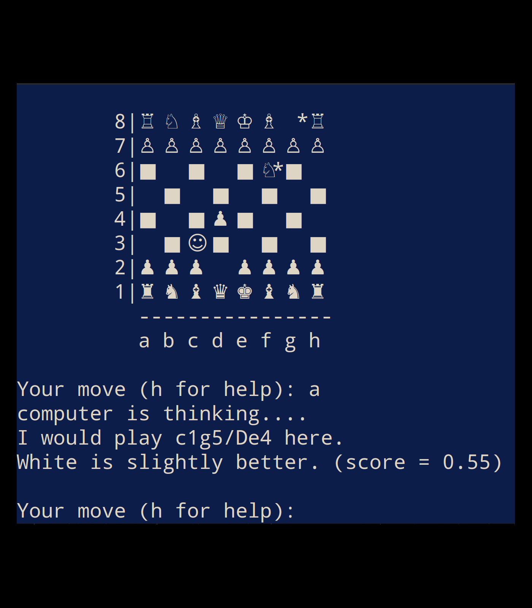

# DuckChess.jl

This is an extremely experimental engine for a variant of chess known as [duckchess](https://duckchess.com/) implemented in Julia. Please note that making good chess engines is a complicated and time-consuming task (especially in C). Even more so for unusual chess variants, where there is often a lack of data and theoretical knowledge.

Features:

1) Play against an engine specifically designed for playing duckchess

2) Load positions from [FEN](https://en.wikipedia.org/wiki/Forsyth%E2%80%93Edwards_Notation) codes and analyze them

# Installation

You will first need to install [Julia](https://julialang.org/), if you do not have it already (be sure to add it to PATH). Julia is a nice and performant programming language. Then, download the content of this repository (or clone if you like git). You will need to install the required packages (in fact, there are not too many of them). To this end, open terminal (<i>command prompt</i> in Windows) in the DuckChess directory, simply type  

```
    julia install_deps.jl
```

and press almighty ENTER.

# How to play

Start the game by running

```
    julia playgame.jl
```
This should start the program in a console and draw the chessboard in the initial configuration. Then, you can submit commands to the program. The most useful commands are:

* ``h`` &nbsp; ->  &nbsp; display help

* ``q`` &nbsp; ->  &nbsp; quit (killing the console is also fine)

Then there are also the less useful commands:

* insert move using [long algebraic notation](https://en.wikipedia.org/wiki/Algebraic_notation_(chess)) (only legal moves accepted)

* ``c``  &nbsp; ->  &nbsp; make computer play for the side which is to move 

* ``a`` &nbsp; ->  &nbsp; use computer to analyze current position

* ``l``  &nbsp; ->  &nbsp; print out the list of legal moves

* ``b``  &nbsp; ->  &nbsp; turn on the blitzmode (use this if you feel the engine takes forever to play a move)

* ``H`` &nbsp; ->  &nbsp; human vs human mode (this is default)

* ``i`` &nbsp; ->  &nbsp; invert the board (handy if you play as black)

* ``n`` &nbsp; ->  &nbsp; start a new game

* ``u`` &nbsp; ->  &nbsp; undo last move

* ``d`` &nbsp; ->  &nbsp; redraw the board (useful when you make so many illegal commands that the board drifts away)

* ``f`` &nbsp; ->  &nbsp; print out FEN code of current position

* ``r`` &nbsp; ->  &nbsp; read position from FEN

* ``U`` &nbsp; ->  &nbsp; switch to UNICODE display (looks nicer but may fail in some obscure operating systems like Windows)

It is recommended to use this program together with a real chessboard. (Duck does not need to be real though - a rubber duck is sufficient.) It is also advised to change display settings of your console to magnify all characters.

# Screenshot
<center>

</center>

That smiling face is a duck. Sadly, I did not find a good Unicode symbol for duck.


# Uninstallation

Just delete the downloaded folder.

# Known limitations

* Engine does not understand stalemates. (Which are extremely rare in duckchess since kings can go into check.)

* Engine is not able to find bishop or rook underpromotions. (Positions, where such underpromotions are best moves are astronomically rare in duckchess.)

* Engine does not understand three-fold repetition and 50 move rule (yet).

* More limitations will be added in future updates.

# Technical details

The program uses an iterative deepening minmax algorithm with alpha-beta pruning and a transposition table. 

Positions are evaluated at leaf nodes using piece-square tables made for standard chess. Weights were obtained from: https://www.chessprogramming.org/PeSTO%27s_Evaluation_Function. I only tweaked the static value of pieces (e.g. knights are now worth much more than bishops, which is why Trompowsky Attack is so good). I also added a small penalty for midgame knight advancement, so that the engine does not lose them instantly in a futile early attack (it still does). Better static evaluation suited for duckchess might come in future. In quiesce search, I only consider recaptures. (If you read everything so far ... wow. Someone reads READMEs?) 

Duck moves are pruned by first playing a <i>null duck move</i>, which removes the duck entirely from the chessboard. Afterwards, the engine scouts for the opponent's reply (at a lower depth). Only duck moves which prevent this reply (including the opponent's duck placement) are investigated. Once a candidate for best duck placement is found at the node, future duck placements must prevent a reply to the best move in addition to the reply of the null duck move.

If you have ideas how to improve this engine, feel free to start a discussion on GitHub webpage of this project.
